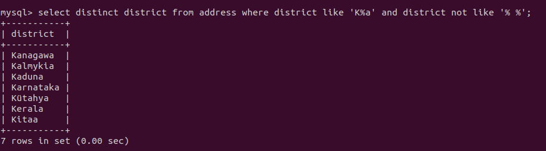
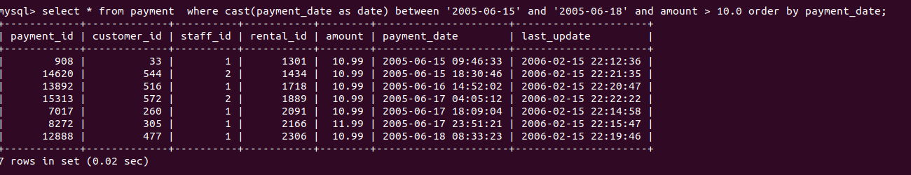
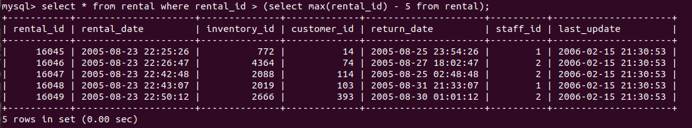
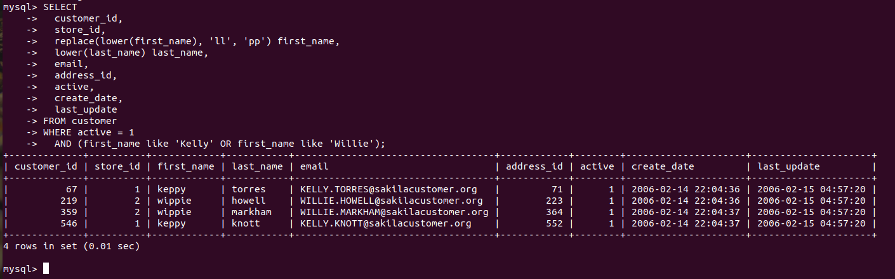

# Домашнее задание к занятию "`SQL. Часть 1`" - `Аблогин Павел`

---

### Задание 1

```
SQL-команда для выполнения задания 1

select 
 distinct district 
from 
 address 
where 
 district like 'K%a' and district not like '% %';

```

`Скриншоты выполнения задания 1`



---

### Задание 2

```
SQL-команда для выполнения задания 2

select * 
from 
 payment  
where 
 cast(payment_date as date) between '2005-06-15' and '2005-06-18' 
 and amount > 10.0 
order by payment_date;

```

`Скриншот выполнения задания 2`



---

### Задание 3

```
SQL-команда для выполнения задания 3

select * 
from 
 rental 
where 
 rental_id > (select max(rental_id) - 5 from rental);

```

`Скриншоты выполнения задания 3`


---

### Задание 4

```
SQL-команда для выполнения задания 4

SELECT 
  customer_id, 
  store_id, 
  replace(lower(first_name), 'll', 'pp') first_name, 
  lower(last_name) last_name, 
  email, 
  address_id, 
  active, 
  create_date, 
  last_update 
FROM customer 
WHERE active = 1 
  AND (first_name like 'Kelly' OR first_name like 'Willie');

```

`Скриншот выполнения задания 4`


---


