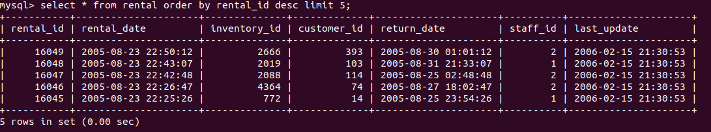

# Домашнее задание к занятию "`SQL. Часть 1`" - `Аблогин Павел`

---

### Задание 1

```
SQL-команда для выполнения задания 1

select 
 distinct district 
from 
 address 
where 
 district like 'K%a' and district not like '% %';

```

`Скриншоты выполнения задания 1`


---

### Задание 2

```
SQL-команда для выполнения задания 2

select * 
from 
 payment  
where 
 cast(payment_date as date) between '2005-06-15' and '2005-06-18' 
 and amount > 10.0 
order by payment_date;

```

`Скриншот выполнения задания 2`


---

### Задание 3

```
SQL-команда для выполнения задания 3

select * 
from 
 rental 
where 
 rental_id > (select max(rental_id) - 5 from rental);

```

`Скриншоты выполнения задания 3`


### Задание 4

`Приведите ответ в свободной форме........`

1. `Заполните здесь этапы выполнения, если требуется ....`
2. `Заполните здесь этапы выполнения, если требуется ....`
3. `Заполните здесь этапы выполнения, если требуется ....`
4. `Заполните здесь этапы выполнения, если требуется ....`
5. `Заполните здесь этапы выполнения, если требуется ....`
6. 

```
Поле для вставки кода...
....
....
....
....
```

`При необходимости прикрепитe сюда скриншоты
`
